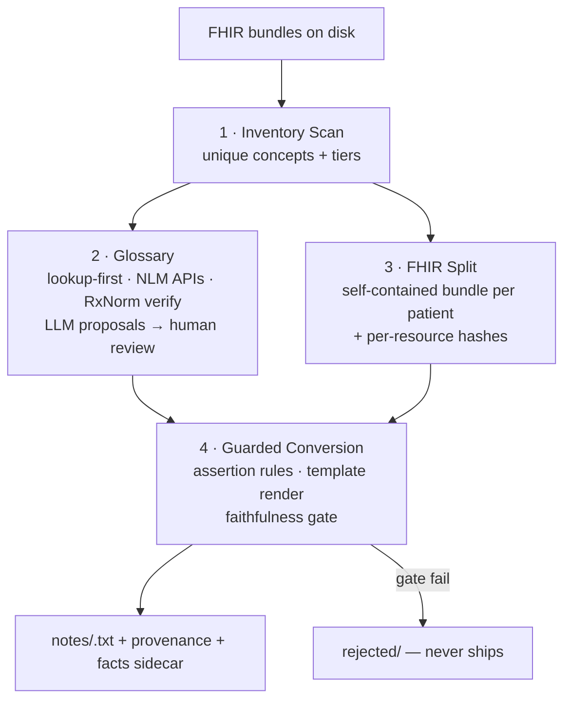
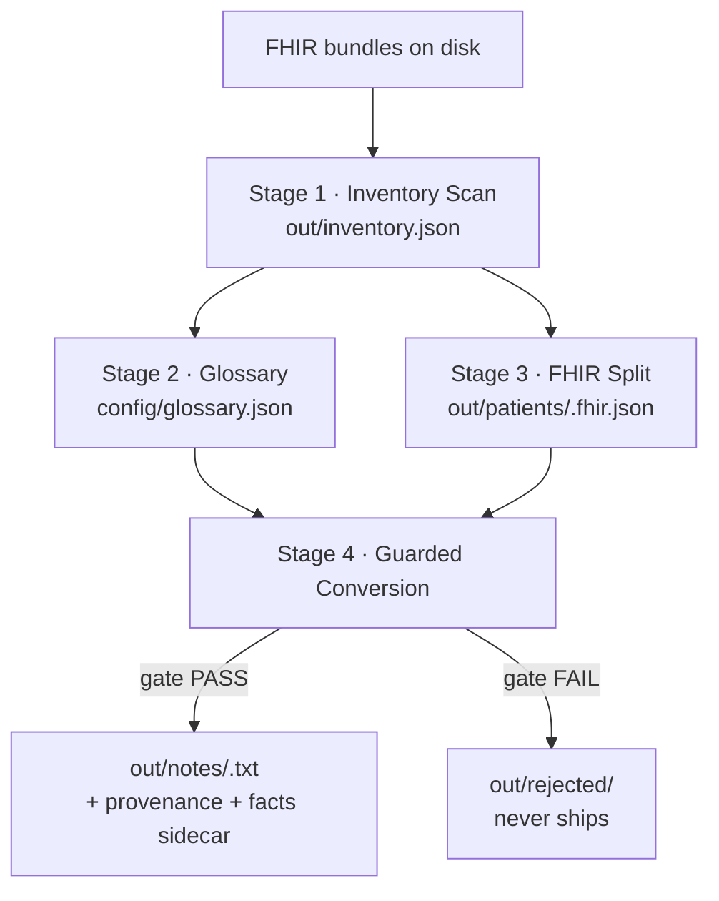
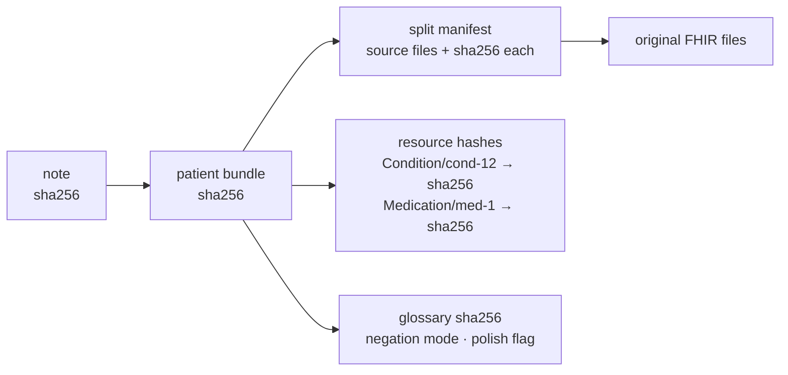

# fhir-to-notes

Convert local FHIR patient data (German hospital terminology) into TREC-style
English patient notes, with every medical term resolved through a human-verified
glossary. Built for the Care-FHIR example export; designed to scale to any
future FHIR dump without code changes.

**Confidentiality: this project processes clinical-shaped data. Everything runs
locally. Nothing - data, derived artifacts, glossaries - is ever uploaded,
sent to an external API by default, or committed anywhere.**

## Quick start

### 1. Clone

```bash
git clone https://github.com/MehulMittal27/fhir-to-notes.git
cd fhir-to-notes
```

### 2. Install

```bash
# Core pipeline: Python 3.11+ and NOTHING else - stages 1-4 are stdlib-only.
python3 --version    # must be >= 3.11

# Optional - only needed for the LLM glossary tier and --llm-polish:
npm install -g @openai/codex     # provides the `codex` CLI (then `codex login`)
```

Without Codex CLI the pipeline still works: ICD/ATC terms resolve via the NLM
APIs, and LLM-tier terms land as unresolved proposals that fail the gate until
resolved manually or by installing Codex later.

### 3. Run

```bash
# Whole pipeline on any directory of FHIR JSON
python src/f2n.py run --input /path/to/fhir/examples

# Or launch the dashboard and run it from the browser
python src/f2n.py ui          # → http://localhost:8790
```

First run generates everything: `config/glossary.json` (review states),
`out/` (inventory, bundles, notes, provenance, caches). Deleting `out/` is
always safe - it fully regenerates; glossary decisions live in `config/` and
survive.

## Pipeline



## CLI reference

| Command | Purpose |
| --- | --- |
| `f2n.py run --input DIR` | Execute stages 1-4 in order |
| `f2n.py status` | Progress at a glance |
| `f2n.py ui [--port 8790]` | Launch the web dashboard |
| `f2n.py stage1 --input DIR` | Inventory scan only |
| `f2n.py stage2` | Glossary resolution only |
| `f2n.py stage3 --input DIR` | Per-patient bundle split only |
| `f2n.py stage4 [--negation-mode omit\|state] [--llm-polish]` | Note generation only |

**Options:**

| Flag | Applies to | Meaning |
| --- | --- | --- |
| `--input DIR` | run, stage1, stage3 | Any directory of FHIR JSON (bundles, single resources, arrays); recursive |
| `--negation-mode omit\|state` | run, stage4 | `omit`: negated facts left out of prose (retrieval-safe). `state`: rendered as "Notable negatives: X: not detected". Only structurally negated facts; cue-only facts always render as "uncertain status". Facts preserved in `out/facts/` either way |
| `--llm-polish` | run, stage4 | Rephrase dosage schedules via LLM; every phrase verified against source numbers + NLM RxNorm before shipping |
| `--glossary FILE` | stage4 | Which glossary to consume (default: the Stage-4 working copy) |
| `--out DIR` | all | Output root (default `out/`) |

## The web UI

```bash
python src/f2n.py ui          # then open http://localhost:8790
```

## The pipeline and WHY each stage exists



### Stage 1 - Inventory Scan
*What:* walk every input file, group resources by patient (`subject.reference`),
collect every unique `(code system, code, display)` triple, classify each into a
translation tier.
*Why first:* both remaining paths depend on knowing what vocabulary exists.
It also sizes the translation problem before any effort is spent on it (the
count is recomputed on every run, so it always reflects the current corpus).

### Stage 2 - Glossary
*What:* resolve every unique concept to an English term. Every concept in the
corpus falls into one of five categories, each handled differently:

1. **Coded concepts → resolved by API.** ICD-10-GM diagnoses (and any ATC codes
   in future data) are language-independent codes: `C79.3` means the same thing
   everywhere. Resolution order: local reference table
   (`config/icd10_atc_en.json`) → **NLM Clinical Tables API** (read-only, bare
   code only, cached forever in `out/term_lookup_cache.json`) → demoted to LLM
   review if both miss. The German display string is never translated - it is
   decoration; the code is the identity.
   NLM serves the US **ICD-10-CM** table, not German ICD-10-GM, so only an
   **exact** code match ships `auto`. When the GM code is absent from CM, NLM may
   return more specific CM codes that start with it (GM `C64`, no side → CM
   `C64.1`, right kidney); such a nearest match is only a proposal: it lands as
   `pending_review` with `match: "prefix"`, the proposed `matched_code`, all
   `cm_candidates`, and a `review_reason` in `config/glossary.json` (also shown
   in the UI glossary tab). A GM-only code with no CM hit gets an LLM proposal,
   also `pending_review` with a `review_reason`. Older glossaries holding a
   nearest match as `auto` are re-routed to review on the next stage-2 run;
   human-`approved` entries are kept.
2. **Already-English concepts → copied verbatim.** LOINC and SNOMED displays
   carry their official English names inside the data itself ("Body temperature",
   "Oral route", "SARS-CoV-2 RNA..."). Zero risk, zero effort, `status: auto`.
3. **Genuinely German terms → LLM proposes, you approve.** OPS procedures and
   hospital-proprietary lab codes have no public English registry anywhere -
   this is structural, not a tooling gap. The configured LLM (Codex CLI) proposes
   a literal English equivalent, grounded against the source string, and each
   proposal waits for human approval (`pending_review` → `approved` in
   `config/glossary.json`). New unseen terms route here automatically on every
   future run.
4. **Near-English administrative stragglers.** A few entries aren't really
   German at all - "MR", "VR", "Ward" are HL7 v2 administrative codes that pass
   through the LLM unchanged. Approving them as-is costs nothing.
5. **International nonproprietary names (the one true hybrid).** ATC drug names
   like Everolimus / Levetiracetam are identical in German and English; only
   trivial spellings differ (*Chinin* → Quinine, *Magnesiumoxid* → Magnesium
   oxide). The glossary handles these as ordinary entries: proposed once,
   reviewed once, then permanent lookups like everything else.

*Why a glossary file instead of inline translation:* the same condition must
render as the same English term in every patient note, forever. A reviewed
lookup table is deterministic, auditable in minutes, and fixable by editing one line.

### Stage 3 - FHIR Split
*What:* emit one self-contained FHIR bundle per patient.
*Why:* TrialMatchAI ingests FHIR natively (`import-patient --format fhir`) -
the structured path needs no prose at all and loses nothing.

### Stage 4 - Guarded Conversion
*What:* per patient, extract facts deterministically from the bundle (demographics,
conditions, observations, procedures, medications - including two-hop joins like
MedicationAdministration → Medication definition), classify each condition and
observation as present, negated, or uncertain, render through a fixed template,
and pass the faithfulness gate.
*Division of labor:* code owns truth. The LLM's contribution lives frozen in the
glossary; it never writes prose that reaches a record directly.
*Assertion states:* a fact is **negated** only on structured FHIR negation:
`Condition.verificationStatus = refuted` (R4 CodeableConcept or STU3 code). A
negation cue in the text alone ("no ", "without ", "keine ", "negativ", ...)
makes the fact **uncertain**, not negated, because cues also occur inside
positive concept names (a "...-negativ" receptor-status diagnosis). Uncertain
facts are rendered in both modes, only inside one qualified sentence:
"Findings of uncertain status: X." Other FHIR statuses (entered-in-error,
resolved, MedicationStatement not-taken, Observation interpretation codes) are
not yet read.
*Negation handling:* negated and uncertain facts never appear in prose as
positive mentions, and an uncertain fact is never stated as "not detected"
(all fatal gate violations). Two modes for negated facts, chosen per run:
- `omit` - negated facts left out of the note (dense retrievers ignore negation,
  so mentioning them risks pulling wrong trials)
- `state` - rendered explicitly as "Notable negatives: X: not detected" -
  clinically faithful, safe because the negation marker is explicit
In both modes every fact is preserved in `out/facts/<id>.facts.json`, the sidecar
that downstream eligibility reasoning consumes ("no history of X" criteria are
satisfied by preserved negatives).
*Optional `--llm-polish`:* routes only medication dosage schedules (e.g. the raw
Cerner string `07:00|1|Tabl.`) through Codex CLI for phrasing. Every proposed
phrase is validated - all numbers must exist in the source schedule, drug name
must match - and drug names are additionally verified against NLM RxNorm before
shipping auto. Unvalidated proposals fall back to raw text. Off by default.

### The web UI in detail

A local single-page dashboard (127.0.0.1 only):
- **Run pipeline** button with live streaming log
- **Patient list** with gate-verdict badges (PASS/FAIL); click to read the actual
  generated prose
- **Download note (.txt)** per patient
- **Provenance panel** per note: bundle sha256, linked resource IDs, source files,
  glossary hash, negation mode - plus a link to the full JSON record
- **Preserved-negatives panel** showing exactly which facts were omitted and why,
  plus an **uncertain-facts panel** naming the cue behind each uncertain fact
- **Glossary tab** showing the union of both glossary files - brand-new terms
  from fresh data appear with a "new" badge and a one-click approve that copies
  them into the Stage-4 working copy (the authoritative review file is untouched)

## Provenance: how a note traces back to FHIR

Every generated note ships with `<pid>.provenance.json` chaining its full ancestry:



Resource hashes are computed over **canonical JSON** (sorted keys), so harmless
re-serialization never breaks a seal while any content change is detected. After a
downstream system matches a patient to a trial, this chain answers "where did that
fact come from": glossary term → resource ID → that resource's own hash, verified
against today's bytes. Editing one unrelated condition invalidates only *that*
resource's seal; every other note's chain stays provably intact.

## Status

| Stage | Status | Entry point |
|---|---|---|
| 1 · Inventory Scan | **ready** | via `f2n.py` |
| 2 · Glossary | **ready** (LLM-tier proposals await formal review) | via `f2n.py` |
| 3 · FHIR Split | **ready** | via `f2n.py` |
| 4 · Conversion | **ready** (omit + state modes, optional LLM polish) | via `f2n.py` |
| Web UI | **ready** | `python src/f2n.py ui` |

## Outputs

Outputs land in `out/`:
- `inventory.json` - unique concepts + tier classification
- `patients/<id>.fhir.json` + `split_manifest.json` - self-contained bundles
- `notes/<id>.txt` + `<id>.provenance.json` - gated notes + ancestry records
- `facts/<id>.facts.json` - full structured facts incl. negated (for eligibility reasoning)
- `gate_report.json` - per-patient verdicts, invented numbers, dropped and
  uncertain facts
- caches: `term_lookup_cache.json`, `llm_polish_cache.json`, `glossary_llm_cache.json`

The working glossary you review lives in `config/glossary.json`.

**Two glossaries, on purpose:**
- `config/glossary.json` - authoritative; holds true review states. Stage 4
  development runs against `config/glossary_stage4.json` (a force-approved
  working copy) so note generation is not blocked on outstanding review.
  Deferred: an `f2n approve` command to regenerate the working copy after real
  review (see docs/decisions.md).
- Resolution order (lookup-first): existing glossary entry → local reference
  table → permanent caches → NLM APIs → LLM proposal. A settled term never
  costs an API call or LLM token again.

Input discovery is recursive: point `--input` at any directory containing FHIR
JSON bundles, single resources, or JSON arrays of resources. Non-FHIR JSON files
are skipped with a warning, never fatal - new data drops in without code changes.

## Design rules (non-negotiable)

1. Local only. No network calls from any stage unless explicitly added with a
   flag and documented here.
2. Determinism at every LLM touchpoint: temperature 0, fixed seed, cached outputs,
   prompt version recorded next to results.
3. Every generated artifact records its inputs' hashes (provenance or it didn't happen).
4. Negation polarity is decided by rules, never by LLM judgment alone: structured
   FHIR negation marks a fact negated; a text cue alone only marks it uncertain.
5. Old artifacts are never overwritten silently: outputs are dated/hashed.

## Tests

```bash
python3 -m unittest discover -s tests -v
```

Stdlib `unittest` with small synthetic fixtures (made-up codes and records).
The NLM lookup and the LLM are mocked, so tests never touch the network or
anything in `out/` or `config/`.

See `AGENTS.md` for agent-facing conventions and `docs/decisions.md` for the
decision log.
